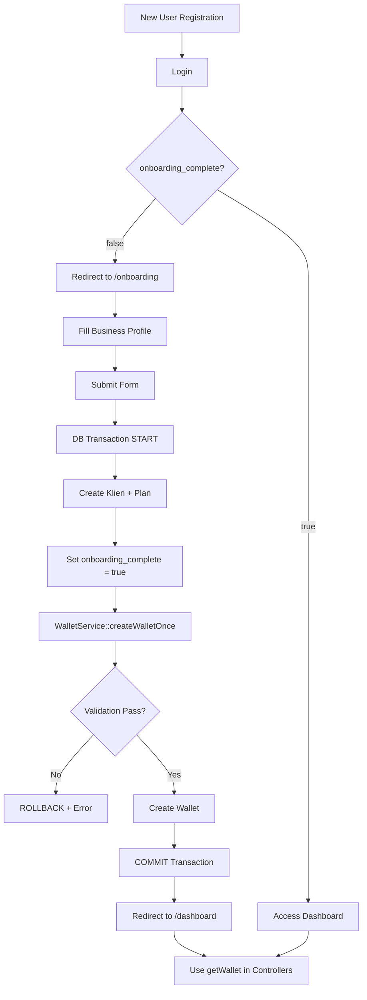

# Wallet Lifecycle Architecture - FINAL

## 🎯 PROBLEM SOLVED

**BEFORE:**
- ❌ Wallet created multiple times (race conditions)
- ❌ Wallet created at wrong time (before onboarding)
- ❌ FK errors, duplicate wallets, redirect loops
- ❌ Wallet logic scattered across controllers/middleware

**AFTER:**
- ✅ Wallet created ONCE per user (database enforced)
- ✅ Wallet created at CORRECT time (after onboarding complete)
- ✅ Race condition safe (transaction + lock)
- ✅ Single point of control (WalletService)

---

## 🏗️ ARCHITECTURE LAYERS

### 1️⃣ DATABASE LAYER (HARD GUARANTEE)

**Location:** `database/migrations/2026_02_08_142152_create_wallets_table.php`

```php
Schema::create('wallets', function (Blueprint $table) {
    $table->foreignId('user_id')->constrained()->onDelete('cascade');
    $table->unique('user_id'); // ✅ ONE WALLET PER USER
});
```

**Guarantees:**
- ✅ `user_id` UNIQUE constraint (DB level)
- ✅ Foreign key `user_id` → `users.id` with CASCADE
- ✅ Cannot insert duplicate wallets (MySQL will reject)

---

### 2️⃣ SERVICE LAYER (BUSINESS LOGIC)

**Location:** `app/Services/WalletService.php`

#### **FINAL CONTRACT:**

```php
// ✅ GET WALLET (READ ONLY - no auto-create)
public function getWallet(User $user): Wallet
{
    // Throws RuntimeException if wallet not found
    // Wallet MUST exist before calling this
}

// ✅ CREATE WALLET ONCE (ONBOARDING ONLY)
public function createWalletOnce(User $user): Wallet
{
    // VALIDATION 1: onboarding_complete MUST be true
    // VALIDATION 2: Wallet MUST NOT already exist
    // Uses DB::transaction + lockForUpdate
    // Throws RuntimeException if validation fails
}

// ⚠️ DEPRECATED (backward compat only)
public function getOrCreateWallet(int $userId): Wallet
{
    // Only used for legacy data migration
    // Will be removed in future
}
```

**ENFORCED RULES:**
1. ✅ `getWallet()` NEVER auto-creates
2. ✅ `createWalletOnce()` validates `onboarding_complete = true`
3. ✅ Race condition safe via `lockForUpdate()`
4. ✅ All operations log to audit trail

---

### 3️⃣ ONBOARDING LAYER (SINGLE CREATION POINT)

**Location:** `app/Http/Controllers/OnboardingController.php`

#### **ATOMIC ONBOARDING FLOW:**

```php
public function store(Request $request)
{
    DB::transaction(function () use ($user, $validated) {
        // Step 1: Create business profile + legacy wallet + plan
        $klien = $this->onboardingService->createBusinessProfile($user, $validated);
        
        // Step 2: Mark onboarding complete (CRITICAL!)
        $user->update([
            'onboarding_complete' => true,
            'onboarding_completed_at' => now(),
        ]);
        
        // Step 3: Create NEW Wallet (ONLY after flag is true)
        $walletService = app(WalletService::class);
        $wallet = $walletService->createWalletOnce($user->fresh());
    });
}
```

**GUARANTEES:**
- ✅ All steps in ONE transaction (atomic)
- ✅ Wallet created ONLY after `onboarding_complete = true`
- ✅ If ANY step fails → ROLLBACK everything
- ✅ This is the ONLY place where wallet is created

---

### 4️⃣ MIDDLEWARE LAYER (GUARD)

**Location:** `app/Http/Middleware/EnsureDomainSetup.php`

#### **SIMPLIFIED LOGIC:**

```php
public function handle(Request $request, Closure $next): Response
{
    // ✅ Check ONLY onboarding_complete flag
    // ❌ Do NOT query wallet
    // ❌ Do NOT query klien
    
    $needsOnboarding = !$user->onboarding_complete;
    
    if ($needsOnboarding) {
        // Allow onboarding routes
        // Block everything else → redirect /onboarding
    }
    
    // Complete → allow everything
    // Block /onboarding → redirect /dashboard
}
```

**RULES:**
- ✅ Check ONLY `onboarding_complete` flag (no DB queries)
- ❌ NEVER create wallet in middleware
- ❌ NEVER query wallet in middleware
- ✅ Separation of concerns (middleware = routing, service = business logic)

---

### 5️⃣ CONTROLLER LAYER (CONSUMERS)

**Locations:**
- `app/Http/Controllers/DashboardController.php`
- `app/Http/Controllers/BillingController.php`

#### **USAGE PATTERN:**

```php
// ✅ CORRECT: Use getWallet() and handle exception
try {
    $wallet = $this->walletService->getWallet($user);
} catch (RuntimeException $e) {
    // Wallet not found = user hasn't completed onboarding
    // This should never happen (middleware blocks), but fail-safe
    abort(403, 'Please complete onboarding first');
}

// ❌ WRONG: Never call getOrCreateWallet or create wallet
$wallet = $this->walletService->getOrCreateWallet($userId); // DEPRECATED
```

**RULES:**
- ✅ ONLY use `getWallet(User $user)`
- ✅ Catch `RuntimeException` if wallet missing
- ❌ NEVER create wallet in controller
- ❌ NEVER bypass onboarding check

---

## 🔒 FAIL-SAFE MECHANISMS

### **1. Database Constraint**
```sql
UNIQUE KEY `wallets_user_id_unique` (`user_id`)
```
- Prevents duplicate wallets (MySQL rejects INSERT)

### **2. Service Validation**
```php
if (!$user->onboarding_complete) {
    throw new RuntimeException("Cannot create wallet: User has not completed onboarding");
}
```
- Prevents premature wallet creation

### **3. Transaction Lock**
```php
DB::transaction(function () use ($user) {
    $existing = Wallet::lockForUpdate()->where('user_id', $user->id)->first();
    if ($existing) {
        throw new RuntimeException("Wallet already exists");
    }
    Wallet::create([...]);
});
```
- Prevents race conditions (parallel requests)

### **4. Middleware Guard**
```php
$needsOnboarding = !$user->onboarding_complete;
```
- Prevents dashboard access before onboarding

---

## 📊 WALLET LIFECYCLE FLOW



---

## 🧪 TEST SCENARIOS

### ✅ **Scenario 1: New User Happy Path**
```
1. User registers → login
2. Middleware checks → onboarding_complete = false → redirect /onboarding
3. User fills form → submit
4. OnboardingController:
   - Creates klien + plan
   - Sets onboarding_complete = true
   - Calls createWalletOnce() → SUCCESS
5. Redirect /dashboard
6. Wallet exists → dashboard loads
```

### ✅ **Scenario 2: Refresh Onboarding Submit (Idempotency)**
```
1. User submits onboarding
2. Transaction starts
3. createWalletOnce() checks existing wallet with LOCK
4. Wallet already exists → throw RuntimeException
5. ROLLBACK transaction
6. Show error: "Wallet already exists"
7. NO DUPLICATE WALLET CREATED ✅
```

### ✅ **Scenario 3: Parallel Requests**
```
1. User submits onboarding 2x simultaneously
2. Request A: Acquires lock → creates wallet
3. Request B: Waits for lock → sees wallet exists → throws error
4. Only 1 wallet created ✅
```

### ✅ **Scenario 4: Dashboard Before Onboarding**
```
1. User tries to access /dashboard
2. Middleware checks → onboarding_complete = false
3. Redirect to /onboarding
4. Wallet NOT created ✅
```

### ✅ **Scenario 5: Existing User**
```
1. User with onboarding_complete = true logs in
2. Middleware → allow access
3. Dashboard calls getWallet($user)
4. Wallet found → page loads
5. Wallet remains intact ✅
```

---

## 🚨 FORBIDDEN PATTERNS

### ❌ **NEVER DO THIS:**

```php
// ❌ Auto-create wallet in controller
$wallet = Wallet::firstOrCreate(['user_id' => $user->id]);

// ❌ Create wallet in middleware
if (!$user->wallet) {
    Wallet::create(['user_id' => $user->id]);
}

// ❌ Create wallet before onboarding
$wallet = WalletService::createWalletOnce($user); // User not onboarded

// ❌ Use getOrCreateWallet in new code
$wallet = $this->walletService->getOrCreateWallet($user->id); // DEPRECATED
```

### ✅ **ALWAYS DO THIS:**

```php
// ✅ Use getWallet and handle exception
try {
    $wallet = $this->walletService->getWallet($user);
} catch (RuntimeException $e) {
    abort(403, 'Please complete onboarding');
}

// ✅ Create wallet ONLY in OnboardingController
$wallet = $walletService->createWalletOnce($user); // After onboarding_complete = true
```

---

## 📝 AUDIT TRAIL

All wallet operations are logged:

```php
// Creation
Log::info('✅ WALLET CREATED', [
    'user_id' => $user->id,
    'wallet_id' => $wallet->id,
    'created_at' => $wallet->created_at,
]);

// Blocked creation
Log::critical('WALLET CREATION BLOCKED: User has not completed onboarding', [
    'user_id' => $user->id,
    'onboarding_complete' => $user->onboarding_complete,
]);

// Duplicate attempt
Log::warning('WALLET CREATION BLOCKED: Wallet already exists', [
    'user_id' => $user->id,
    'wallet_id' => $existing->id,
]);
```

---

## 🎯 SUCCESS CRITERIA

✅ **Wallet created exactly ONCE per user**
✅ **No FK constraint errors**
✅ **No duplicate wallets**
✅ **No wallet creation outside onboarding**
✅ **Dashboard & Billing stable**
✅ **Race conditions handled**
✅ **Redirect loops eliminated**
✅ **Clean separation of concerns**

---

## 🔗 FILE REFERENCE

| File | Role | Key Changes |
|------|------|-------------|
| `WalletService.php` | SSOT for wallet ops | `getWallet()` throws, `createWalletOnce()` validates |
| `OnboardingController.php` | ONLY creation point | Transaction + wallet creation |
| `OnboardingService.php` | Business profile | Removed wallet creation |
| `EnsureDomainSetup.php` | Middleware guard | Check flag only, no wallet query |
| `DashboardController.php` | Consumer | Use `getWallet()`, handle exception |
| `BillingController.php` | Consumer | Use `getWallet()`, handle exception |
| `2026_02_08_142152_create_wallets_table.php` | DB schema | UNIQUE constraint + FK |

---

**Architecture finalized on:** February 10, 2026  
**Status:** ✅ Production Ready
